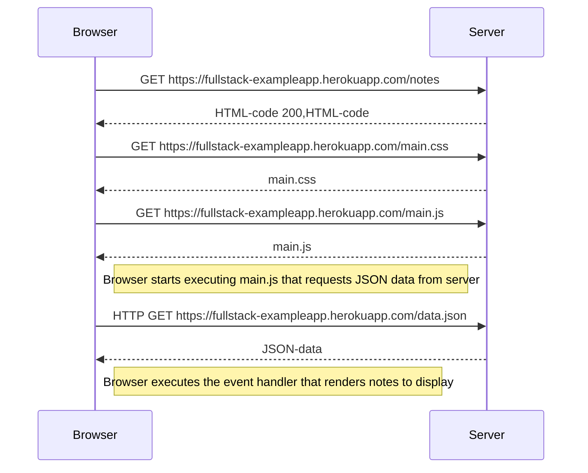

```mermaid

sequenceDiagram
    participant Browser
    participant Server
    
    Browser->>Server: GET https://fullstack-exampleapp.herokuapp.com/notes
    Server-->>Browser: HTML-code 200,HTML-code
    Browser->>Server: GET https://fullstack-exampleapp.herokuapp.com/main.css
    Server-->>Browser: main.css
    Browser->>Server: GET https://fullstack-exampleapp.herokuapp.com/main.js
    Server-->>Browser: main.js
    note right of Browser: Browser starts executing main.js that requests JSON data from server
    Browser->>Server: HTTP GET https://fullstack-exampleapp.herokuapp.com/data.json
    Server-->>Browser: JSON-data
    note right of Browser: Browser executes the event handler that renders notes to display

```